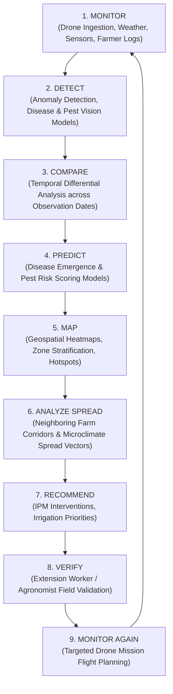
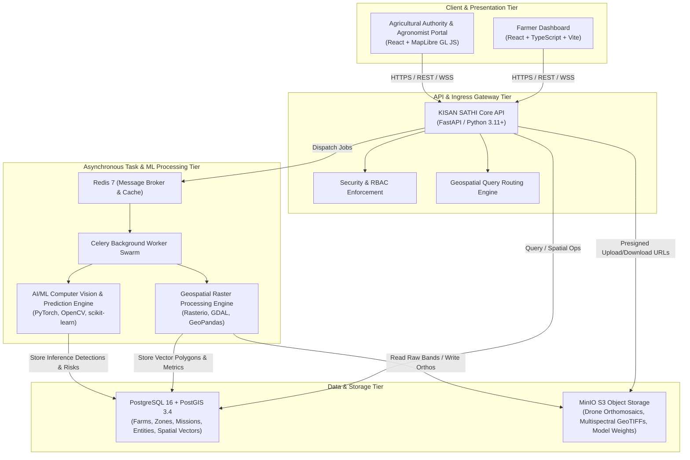

# KISAN SATHI — System Architecture Specification

## 1. Executive Overview

**KISAN SATHI** is an enterprise-grade AI-powered crop health monitoring, disease early detection, and spread intelligence system. It continuously ingests, processes, and analyzes multi-modal agricultural land data—including drone RGB/multispectral/thermal imagery, IoT telemetry, weather streams, and farmer ground observations—to provide actionable disease hotspots, risk forecasts, and Integrated Pest Management (IPM) recommendations.

---

## 2. Core Architectural Paradigm: The Continuous Intelligence Loop

The system operates on an automated, iterative 9-stage intelligence cycle:

---

## 3. High-Level System Architecture (C4 Container View)

---

## 4. Subsystem Breakdown

### 4.1 Client Layer (Frontend)
- **Framework**: React 18 with TypeScript 5, Vite bundler, and Tailwind CSS.
- **Geospatial Mapping**: MapLibre GL JS with vector tile rendering and raster overlay layers (NDVI colormaps, thermal isotherms, disease boundary polygons).
- **Core Views**:
  - **Farm & Zone Registry**: Boundary polygon drawing tools, zone zoning calculator.
  - **Mission Commander**: Drone mission timeline, flight telemetry, raster upload status.
  - **Health Intelligence Center**: Multi-temporal slider, disease detection overlays, anomaly bounding boxes.
  - **Spread Intelligence Radar**: Buffer zone neighbor risk heatmaps and wind-vector spread trajectories.
  - **Expert Validation Terminal**: Agronomist verification queue with ground-truth tagging.

### 4.2 API Layer (Backend)
- **Framework**: FastAPI (Async ASGI) on Python 3.11+.
- **Database Access**: SQLAlchemy 2.0 ORM with `asyncpg` async driver and `GeoAlchemy2` for spatial geometry binding.
- **Data Validation**: Pydantic v2 schemas for all I/O boundaries.
- **Security**: JWT authentication, fine-grained RBAC (Farmer, Extension Officer, Regional Authority, System Administrator).

### 4.3 Geospatial & Raster Engine
- **Libraries**: GeoPandas, Shapely, Rasterio, GDAL.
- **Core Operations**:
  - Auto-subdivision of farm polygons into grid-based or topological crop health monitoring zones.
  - Calculation of vegetative indices:
    - **NDVI** (Normalized Difference Vegetation Index): $(NIR - Red) / (NIR + Red)$
    - **NDRE** (Normalized Difference Red Edge): $(NIR - RE) / (NIR + RE)$
    - **CWSI** (Crop Water Stress Index): Derived from thermal bands and ambient weather.
  - Zonal statistics computation (mean/min/variance index per monitoring zone).

### 4.4 AI / ML Inference & Spread Intelligence Engine
- **Deep Learning Framework**: PyTorch with GPU / CPU execution profiles.
- **Model Pipeline**:
  - **Stage 1 (Anomaly Detection)**: Convolutional / Vision Transformer feature extractors for canopy stress signatures.
  - **Stage 2 (Disease & Pest Classifier)**: Multi-class crop disease detection (e.g., blight, rust, leaf spot, mildew, stem borers).
  - **Stage 3 (Temporal Health Predictor)**: Time-series change detection comparing multi-date mission rasters.
  - **Stage 4 (Regional Spread Simulator)**: Graph and spatial buffer model integrating wind velocity, humidity, crop proximity, and neighboring infestation nodes.

### 4.5 Storage Architecture
- **Relational & Spatial Database (PostgreSQL 16 + PostGIS 3.4)**:
  - Vector geometries stored with spatial indices (`USING GIST (geometry)`).
  - Strict foreign key constraints across `farms`, `monitoring_zones`, `crops`, `missions`, `imagery_assets`, `health_observations`, `disease_detections`, `spread_analyses`, and `ipm_recommendations`.
- **Object Storage (MinIO / S3)**:
  - Structured bucket hierarchy:
    - `kisansathi-raw-imagery/`: Raw uploaded drone image sets & flight telemetry logs.
    - `kisansathi-orthomosaics/`: Stitched GeoTIFFs and COGs (Cloud Optimized GeoTIFFs).
    - `kisansathi-index-rasters/`: Processed NDVI / NDRE / Thermal colormap rasters and tile caches.
    - `kisansathi-model-artifacts/`: Trained PyTorch weights and calibration files.

---

## 5. Security & Reliability Architecture
- **Environment Isolation**: Complete decoupling of configuration from source code via `.env` specifications.
- **Presigned URL Architecture**: Direct client-to-MinIO uploads for gigabyte-scale drone imagery sets, bypassing backend memory bottlenecks.
- **Fault-Tolerant Workers**: Celery workers with task acknowledgment (`acks_late=True`) and Redis-backed state tracking.
- **Audit Trails**: Full temporal logging of all agronomic validations, alert dismissals, and system-generated IPM interventions.
