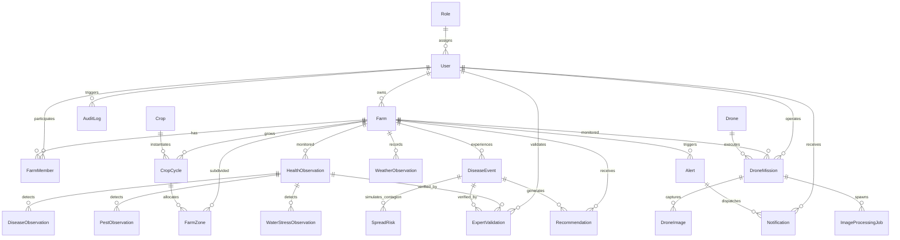

# KISAN SATHI — PostGIS Database Architecture & Data Dictionary

## 1. Architectural Overview

**KISAN SATHI** utilizes **PostgreSQL 16** with the **PostGIS 3.4** spatial engine to manage relational entities, spatial vector boundaries, multi-modal sensor streams, and multi-temporal crop pathology intelligence.

### 1.1 Spatial Reference Standard
- **Standard Storage SRID**: `EPSG:4326` (WGS 84 GPS Coordinates: Longitude, Latitude).
- **Calculation Projection**: `EPSG:3857` (Web Mercator) or local UTM zones for metric distance buffers and surface area integrals (`ST_Area`, `ST_DWithin`).
- **Spatial Indexing**: All geometry columns utilize `GIST` (Generalized Search Tree) spatial indexing for sub-millisecond bounding box lookups and polygon containment operations.

---

## 2. Entity Relationship Overview

The schema is organized into 7 cohesive domains encompassing **24 database entities**:



---

## 3. Comprehensive Data Dictionary

### 3.1 Authentication & RBAC Domain

#### Table: `roles`
| Column | Type | Constraints | Description |
| :--- | :--- | :--- | :--- |
| `id` | `VARCHAR(36)` | PK | Unique UUID identifier |
| `name` | `VARCHAR(50)` | UNIQUE, NOT NULL, INDEX | Role slug (`admin`, `agronomist`, `farmer`, `authority`) |
| `description` | `VARCHAR(255)` | NULL | Human-readable role description |
| `permissions` | `JSON` | NULL | Granular permission capabilities matrix |
| `created_at` / `updated_at` | `TIMESTAMPTZ` | NOT NULL | Audit timestamps |

#### Table: `users`
| Column | Type | Constraints | Description |
| :--- | :--- | :--- | :--- |
| `id` | `VARCHAR(36)` | PK | Unique UUID identifier |
| `email` | `VARCHAR(255)` | UNIQUE, NOT NULL, INDEX | Login email address |
| `hashed_password` | `VARCHAR(255)` | NOT NULL | Bcrypt hashed credential |
| `full_name` | `VARCHAR(150)` | NOT NULL | User's legal name |
| `phone_number` | `VARCHAR(30)` | NULL | Mobile phone for SMS alerting |
| `is_active` | `BOOLEAN` | NOT NULL, DEFAULT TRUE | Account operational status |
| `is_superuser` | `BOOLEAN` | NOT NULL, DEFAULT FALSE | Root system administration flag |
| `role_id` | `VARCHAR(36)` | FK(`roles.id`), INDEX | Assigned authorization role |

---

### 3.2 Farm & Agronomic Topology Domain

#### Table: `farms`
| Column | Type | Constraints | Description |
| :--- | :--- | :--- | :--- |
| `id` | `VARCHAR(36)` | PK | Unique UUID identifier |
| `name` | `VARCHAR(150)` | NOT NULL, INDEX | Farm estate designation |
| `owner_id` | `VARCHAR(36)` | FK(`users.id`), NOT NULL, INDEX | Primary farm owner |
| `boundary` | `GEOMETRY(MULTIPOLYGON, 4326)` | NOT NULL, GIST INDEX | Complete legal vector boundary polygon |
| `center_point` | `GEOMETRY(POINT, 4326)` | NULL, GIST INDEX | Centroid point for quick map positioning |
| `total_area_hectares` | `FLOAT` | NOT NULL | Calculated surface area in hectares |
| `soil_type` | `VARCHAR(100)` | NULL | Soil classification (e.g., Vertisol, Loam) |
| `city` / `region` / `country`| `VARCHAR(100)` | INDEX | Geographic regional hierarchy |

#### Table: `farm_members`
| Column | Type | Constraints | Description |
| :--- | :--- | :--- | :--- |
| `id` | `VARCHAR(36)` | PK | Unique UUID identifier |
| `farm_id` | `VARCHAR(36)` | FK(`farms.id`), NOT NULL | Associated farm holding |
| `user_id` | `VARCHAR(36)` | FK(`users.id`), NOT NULL | Associated user account |
| `role_in_farm` | `VARCHAR(50)` | NOT NULL | Operational role (`owner`, `manager`, `agronomist`, `scout`, `worker`) |
| *Constraint* | `UNIQUE(farm_id, user_id)` | — | Enforces unique user membership per farm |

#### Table: `crops`
| Column | Type | Constraints | Description |
| :--- | :--- | :--- | :--- |
| `id` | `VARCHAR(36)` | PK | Unique UUID identifier |
| `common_name` | `VARCHAR(100)` | NOT NULL, INDEX | Common plant name (`Wheat`, `Maize`, `Rice`) |
| `scientific_name` | `VARCHAR(150)` | NOT NULL | Botanical binomial nomenclature |
| `variety` | `VARCHAR(100)` | NULL | Specific cultivar or hybrid designation |
| `typical_growing_days` | `INTEGER` | NOT NULL | Standard days to physiological maturity |
| `growth_stages` | `JSON` | NULL | Phenology calendar breakdown |

#### Table: `crop_cycles`
| Column | Type | Constraints | Description |
| :--- | :--- | :--- | :--- |
| `id` | `VARCHAR(36)` | PK | Unique UUID identifier |
| `farm_id` | `VARCHAR(36)` | FK(`farms.id`), NOT NULL, INDEX | Farm estate |
| `crop_id` | `VARCHAR(36)` | FK(`crops.id`), NOT NULL, INDEX | Plant species |
| `planting_date` | `DATE` | NOT NULL, INDEX | Sowing / transplantation date |
| `status` | `VARCHAR(50)` | NOT NULL, INDEX | Lifecycle stage (`planned`, `active`, `harvested`, `terminated`) |
| `target_yield_tonnes_per_hectare` | `FLOAT` | NULL | Expected yield benchmark |

#### Table: `farm_zones`
| Column | Type | Constraints | Description |
| :--- | :--- | :--- | :--- |
| `id` | `VARCHAR(36)` | PK | Unique UUID identifier |
| `farm_id` | `VARCHAR(36)` | FK(`farms.id`), NOT NULL, INDEX | Parent farm |
| `crop_cycle_id` | `VARCHAR(36)` | FK(`crop_cycles.id`), NULL, INDEX | Currently planted seasonal crop cycle |
| `zone_code` | `VARCHAR(20)` | NOT NULL | Short code (`Z-01`, `Z-02`) |
| `name` | `VARCHAR(100)` | NOT NULL | Descriptive plot name |
| `boundary` | `GEOMETRY(POLYGON, 4326)` | NOT NULL, GIST INDEX | Subdivided topological zone boundary |
| `area_hectares` | `FLOAT` | NOT NULL | Computed zone surface area |
| `irrigation_type` | `VARCHAR(50)` | NULL | Irrigation system (`drip`, `sprinkler`, `flood`, `rainfed`) |
| *Constraint* | `UNIQUE(farm_id, zone_code)` | — | Ensures unique zone codes per farm |

---

### 3.3 Drone & Imagery Capture Domain

#### Table: `drones`
| Column | Type | Constraints | Description |
| :--- | :--- | :--- | :--- |
| `id` | `VARCHAR(36)` | PK | Unique UUID identifier |
| `serial_number` | `VARCHAR(100)` | UNIQUE, NOT NULL, INDEX | Manufacturer hardware serial number |
| `model_name` | `VARCHAR(100)` | NOT NULL | Drone airframe model |
| `sensor_types` | `JSON` | NULL | Array of onboard sensors (`RGB`, `Multispectral`, `Thermal`) |
| `battery_cycle_count` | `INTEGER` | NOT NULL, DEFAULT 0 | Battery health tracker |
| `status` | `VARCHAR(50)` | NOT NULL, INDEX | State (`idle`, `in_mission`, `maintenance`, `retired`) |

#### Table: `drone_missions`
| Column | Type | Constraints | Description |
| :--- | :--- | :--- | :--- |
| `id` | `VARCHAR(36)` | PK | Unique UUID identifier |
| `farm_id` | `VARCHAR(36)` | FK(`farms.id`), NOT NULL, INDEX | Monitored farm |
| `drone_id` | `VARCHAR(36)` | FK(`drones.id`), NULL, INDEX | Assigned UAV airframe |
| `operator_id` | `VARCHAR(36)` | FK(`users.id`), NULL, INDEX | Mission pilot |
| `flight_boundary` | `GEOMETRY(POLYGON, 4326)` | NOT NULL, GIST INDEX | Planned spatial flight boundary corridor |
| `mission_date` | `TIMESTAMPTZ` | NOT NULL, INDEX | Scheduled / execution timestamp |
| `altitude_meters` | `FLOAT` | NOT NULL | AGL survey altitude |
| `status` | `VARCHAR(50)` | NOT NULL, INDEX | Flight status (`scheduled`, `in_progress`, `completed`, `failed`, `cancelled`) |

#### Table: `drone_images`
| Column | Type | Constraints | Description |
| :--- | :--- | :--- | :--- |
| `id` | `VARCHAR(36)` | PK | Unique UUID identifier |
| `mission_id` | `VARCHAR(36)` | FK(`drone_missions.id`), NOT NULL, INDEX | Parent survey mission |
| `zone_id` | `VARCHAR(36)` | FK(`farm_zones.id`), NULL, INDEX | Overlapping monitoring zone |
| `file_path` | `VARCHAR(512)` | NOT NULL | MinIO / S3 object key |
| `image_type` | `VARCHAR(50)` | NOT NULL, INDEX | Optical band (`rgb`, `multispectral`, `thermal`, `ndvi`, `ndre`) |
| `capture_time` | `TIMESTAMPTZ` | NOT NULL, INDEX | Camera shutter timestamp |
| `location` | `GEOMETRY(POINT, 4326)` | NOT NULL, GIST INDEX | GPS capture point (Longitude, Latitude) |
| `footprint` | `GEOMETRY(POLYGON, 4326)` | NULL, GIST INDEX | Ground projection polygon footprint |
| `file_size_bytes` | `BIGINT` | NOT NULL | Storage footprint size |

#### Table: `image_processing_jobs`
| Column | Type | Constraints | Description |
| :--- | :--- | :--- | :--- |
| `id` | `VARCHAR(36)` | PK | Unique UUID identifier |
| `mission_id` | `VARCHAR(36)` | FK(`drone_missions.id`), NOT NULL, INDEX | Related mission |
| `job_type` | `VARCHAR(50)` | NOT NULL, INDEX | Pipeline (`orthomosaic_generation`, `ndvi_calculation`, `anomaly_segmentation`) |
| `status` | `VARCHAR(50)` | NOT NULL, INDEX | Worker execution state (`queued`, `running`, `completed`, `failed`) |
| `progress_percent` | `FLOAT` | NOT NULL, DEFAULT 0.0 | Processing completion percentage |
| `celery_task_id` | `VARCHAR(100)` | NULL, INDEX | Asynchronous Celery task correlation ID |

---

### 3.4 Multi-Modal Observations Domain

#### Table: `health_observations`
| Column | Type | Constraints | Description |
| :--- | :--- | :--- | :--- |
| `id` | `VARCHAR(36)` | PK | Unique UUID identifier |
| `farm_id` | `VARCHAR(36)` | FK(`farms.id`), NOT NULL, INDEX | Farm estate |
| `zone_id` | `VARCHAR(36)` | FK(`farm_zones.id`), NULL, INDEX | Monitoring zone |
| `mission_id` | `VARCHAR(36)` | FK(`drone_missions.id`), NULL, INDEX | Survey source mission |
| `observation_date` | `TIMESTAMPTZ` | NOT NULL, INDEX | Date of observation |
| `location` | `GEOMETRY(POINT, 4326)` | NOT NULL, GIST INDEX | Spatial center of observation |
| `affected_polygon` | `GEOMETRY(POLYGON, 4326)` | NULL, GIST INDEX | Delineated anomaly polygon boundary |
| `mean_ndvi` | `FLOAT` | NULL | Normalized Difference Vegetation Index $(-1.0 \text{ to } 1.0)$ |
| `mean_ndre` | `FLOAT` | NULL | Normalized Difference Red Edge Index |
| `mean_canopy_temp_c`| `FLOAT` | NULL | Thermal canopy temperature in Celsius |
| `overall_health_score` | `FLOAT` | NOT NULL, DEFAULT 1.0 | Composite vitality score $(0.0 \text{ to } 1.0)$ |
| `trend` | `VARCHAR(50)` | NOT NULL, INDEX | Temporal direction (`improving`, `stable`, `deteriorating`) |

#### Table: `disease_observations`
| Column | Type | Constraints | Description |
| :--- | :--- | :--- | :--- |
| `id` | `VARCHAR(36)` | PK | Unique UUID identifier |
| `health_observation_id` | `VARCHAR(36)` | FK(`health_observations.id`), NULL, INDEX | Parent health measurement |
| `farm_id` | `VARCHAR(36)` | FK(`farms.id`), NOT NULL, INDEX | Farm estate |
| `zone_id` | `VARCHAR(36)` | FK(`farm_zones.id`), NULL, INDEX | Monitoring zone |
| `disease_name` | `VARCHAR(150)` | NOT NULL, INDEX | Identified pathology (e.g., `Late Blight`, `Yellow Rust`) |
| `pathogen_type` | `VARCHAR(50)` | NOT NULL | Type (`fungal`, `bacterial`, `viral`, `nematode`, `physiological`) |
| `severity_level` | `VARCHAR(50)` | NOT NULL, INDEX | Severity (`low`, `moderate`, `high`, `critical`) |
| `confidence_score` | `FLOAT` | NOT NULL | AI vision model confidence probability $(0.0 \text{ to } 1.0)$ |
| `location` | `GEOMETRY(POINT, 4326)` | NOT NULL, GIST INDEX | Point location of detected symptom |

#### Table: `pest_observations`
| Column | Type | Constraints | Description |
| :--- | :--- | :--- | :--- |
| `id` | `VARCHAR(36)` | PK | Unique UUID identifier |
| `health_observation_id` | `VARCHAR(36)` | FK(`health_observations.id`), NULL, INDEX | Parent health measurement |
| `pest_name` | `VARCHAR(150)` | NOT NULL, INDEX | Pest species (`Fall Armyworm`, `Wheat Aphid`, `Stem Borer`) |
| `infestation_level` | `VARCHAR(50)` | NOT NULL, INDEX | Infestation tier (`low`, `moderate`, `high`, `severe`) |
| `affected_area_percentage`| `FLOAT` | NOT NULL | Canopy defoliation percentage |
| `location` | `GEOMETRY(POINT, 4326)` | NOT NULL, GIST INDEX | Infestation cluster coordinate |

#### Table: `water_stress_observations`
| Column | Type | Constraints | Description |
| :--- | :--- | :--- | :--- |
| `id` | `VARCHAR(36)` | PK | Unique UUID identifier |
| `cwsi_index` | `FLOAT` | NOT NULL | Crop Water Stress Index $(0.0 \text{ to } 1.0)$ |
| `canopy_air_temp_diff_c` | `FLOAT` | NOT NULL | $\Delta T = T_{\text{canopy}} - T_{\text{air}}$ |
| `stress_category` | `VARCHAR(50)` | NOT NULL, INDEX | Water stress status (`none`, `mild`, `moderate`, `severe`) |
| `location` | `GEOMETRY(POINT, 4326)` | NOT NULL, GIST INDEX | Sensor reading coordinate |

#### Table: `weather_observations`
| Column | Type | Constraints | Description |
| :--- | :--- | :--- | :--- |
| `id` | `VARCHAR(36)` | PK | Unique UUID identifier |
| `farm_id` | `VARCHAR(36)` | FK(`farms.id`), NOT NULL, INDEX | Farm estate |
| `location` | `GEOMETRY(POINT, 4326)` | NOT NULL, GIST INDEX | Weather station location |
| `observation_time`| `TIMESTAMPTZ` | NOT NULL, INDEX | Timestamp of meteorological reading |
| `temperature_c` | `FLOAT` | NOT NULL | Ambient dry bulb temperature |
| `relative_humidity_percent` | `FLOAT` | NOT NULL | Relative humidity percentage |
| `wind_speed_mps` | `FLOAT` | NOT NULL | Anemometer wind speed in m/s |
| `wind_direction_deg` | `FLOAT` | NOT NULL | Wind heading in azimuth degrees $(0 - 360^\circ)$ |
| `rainfall_mm` | `FLOAT` | NOT NULL | Precipitation accumulation |

---

### 3.5 Spread Intelligence, Advisory & Alerting Domain

#### Table: `risk_assessments`
| Column | Type | Constraints | Description |
| :--- | :--- | :--- | :--- |
| `id` | `VARCHAR(36)` | PK | Unique UUID identifier |
| `farm_id` | `VARCHAR(36)` | FK(`farms.id`), NOT NULL, INDEX | Target farm |
| `assessment_date` | `TIMESTAMPTZ` | NOT NULL, INDEX | Assessment run timestamp |
| `target_pathogen_or_pest`| `VARCHAR(150)` | NOT NULL | Evaluated biological threat |
| `risk_score` | `FLOAT` | NOT NULL | Calculated probability score $(0.0 \text{ to } 1.0)$ |
| `risk_level` | `VARCHAR(50)` | NOT NULL, INDEX | Categorical risk (`very_low`, `low`, `medium`, `high`, `severe`) |
| `forecast_window_days` | `INTEGER` | NOT NULL, DEFAULT 7 | Risk forecast lookahead horizon |

#### Table: `disease_events`
| Column | Type | Constraints | Description |
| :--- | :--- | :--- | :--- |
| `id` | `VARCHAR(36)` | PK | Unique UUID identifier |
| `farm_id` | `VARCHAR(36)` | FK(`farms.id`), NOT NULL, INDEX | Outbreak epicenter farm |
| `event_name` | `VARCHAR(150)` | NOT NULL | Outbreak incident code name |
| `pathogen_or_pest`| `VARCHAR(150)` | NOT NULL, INDEX | Pathogen / pest causal agent |
| `outbreak_status` | `VARCHAR(50)` | NOT NULL, INDEX | Incident status (`suspected`, `confirmed`, `contained`, `resolved`) |
| `start_date` | `TIMESTAMPTZ` | NOT NULL, INDEX | Emergence date |
| `epicenter` | `GEOMETRY(POINT, 4326)` | NOT NULL, GIST INDEX | Outbreak focal point coordinate |
| `affected_boundary` | `GEOMETRY(POLYGON, 4326)` | NULL, GIST INDEX | Delineated containment boundary |

#### Table: `spread_risks`
| Column | Type | Constraints | Description |
| :--- | :--- | :--- | :--- |
| `id` | `VARCHAR(36)` | PK | Unique UUID identifier |
| `source_disease_event_id` | `VARCHAR(36)` | FK(`disease_events.id`), NOT NULL, INDEX | Originating outbreak |
| `source_farm_id` | `VARCHAR(36)` | FK(`farms.id`), NOT NULL, INDEX | Source farm |
| `target_farm_id` | `VARCHAR(36)` | FK(`farms.id`), NOT NULL, INDEX | At-risk neighboring farm |
| `spread_probability` | `FLOAT` | NOT NULL | Contagion probability $(0.0 \text{ to } 1.0)$ |
| `estimated_arrival_days` | `INTEGER` | NULL | Estimated days until threshold contagion |
| `risk_corridor` | `GEOMETRY(POLYGON, 4326)` | NULL, GIST INDEX | Spatial corridor polygon modeling wind plume |
| `proximity_meters` | `FLOAT` | NOT NULL | Inter-boundary geodesic distance |

#### Table: `recommendations`
| Column | Type | Constraints | Description |
| :--- | :--- | :--- | :--- |
| `id` | `VARCHAR(36)` | PK | Unique UUID identifier |
| `farm_id` | `VARCHAR(36)` | FK(`farms.id`), NOT NULL, INDEX | Target farm |
| `recommendation_type` | `VARCHAR(50)` | NOT NULL, INDEX | IPM modality (`chemical_ipm`, `biological_ipm`, `cultural_ipm`, `irrigation_priority`) |
| `priority` | `VARCHAR(50)` | NOT NULL, INDEX | Priority level (`low`, `medium`, `high`, `urgent`) |
| `title` | `VARCHAR(200)` | NOT NULL | Prescribed intervention title |
| `action_items` | `JSON` | NOT NULL | Step-by-step procedural guidelines |
| `dosage_or_rate` | `VARCHAR(100)` | NULL | Chemical / bio-agent application concentration |
| `status` | `VARCHAR(50)` | NOT NULL, INDEX | State (`pending`, `applied`, `rejected`, `expired`) |

#### Table: `expert_validations`
| Column | Type | Constraints | Description |
| :--- | :--- | :--- | :--- |
| `id` | `VARCHAR(36)` | PK | Unique UUID identifier |
| `expert_user_id` | `VARCHAR(36)` | FK(`users.id`), NOT NULL, INDEX | Reviewing agronomist |
| `validation_status` | `VARCHAR(50)` | NOT NULL, INDEX | Diagnosis (`confirmed`, `false_positive`, `inconclusive`, `revised`) |
| `confidence_rating` | `INTEGER` | NOT NULL, DEFAULT 5 | Agronomist confidence rating $(1 - 5)$ |
| `validated_at` | `TIMESTAMPTZ` | NOT NULL, INDEX | Ground-truth verification timestamp |

#### Table: `alerts` & `notifications`
| Table | Key Columns | Spatial Geometry | Description |
| :--- | :--- | :--- | :--- |
| `alerts` | `alert_type`, `severity`, `title`, `is_resolved` | `location`: `POINT(4326)` | Urgent automated farm hazard alerts |
| `notifications` | `user_id`, `alert_id`, `channel`, `is_read`, `sent_status` | — | Multi-channel dispatch queue |
| `audit_logs` | `user_id`, `action`, `entity_type`, `entity_id`, `timestamp` | — | Immutable audit logging trail |

---

## 4. Key Spatial & Temporal Query Patterns

### 4.1 Zone Polygon Containment Query
```sql
SELECT z.zone_code, z.name, ST_AsGeoJSON(z.boundary)
FROM farm_zones z
WHERE ST_Contains(z.boundary, ST_SetSRID(ST_MakePoint(73.8515, 18.5235), 4326));
```

### 4.2 Neighboring Farm Proximity Buffer (ST_DWithin)
```sql
SELECT f2.id, f2.name, ST_Distance(f1.boundary::geography, f2.boundary::geography) AS distance_meters
FROM farms f1, farms f2
WHERE f1.id = :source_farm_id AND f2.id != f1.id
  AND ST_DWithin(f1.boundary::geography, f2.boundary::geography, 5000.0);
```

### 4.3 Temporal Health Observation Trend Query
```sql
SELECT date_trunc('day', observation_date) AS obs_day,
       AVG(mean_ndvi) AS avg_ndvi,
       AVG(mean_ndre) AS avg_ndre
FROM health_observations
WHERE farm_id = :farm_id AND observation_date >= NOW() - INTERVAL '30 days'
GROUP BY obs_day
ORDER BY obs_day ASC;
```
